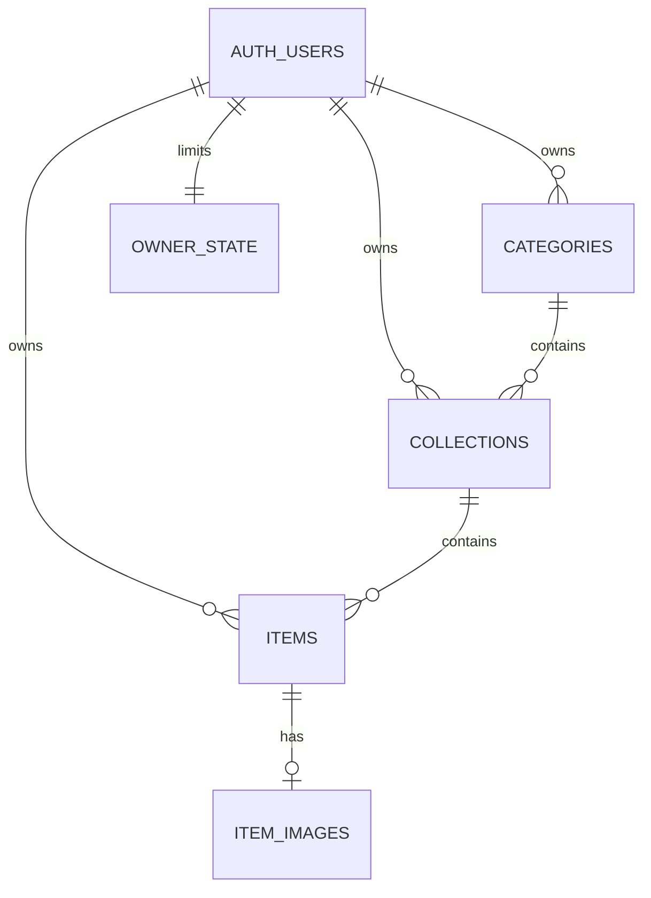

# Backend integration plan

## Current delivery: backend integration

The Expo frontend is usable through **Try the demo** with no credentials or services. A fresh repository in memory supplies sample items on each visit. Edits and chosen photos reset when leaving/reloading; they are not uploaded. Account forms are present, but live access is disabled unless `EXPO_PUBLIC_ENABLE_BACKEND=true` and valid public configuration are supplied.

The user has created the Supabase project and R2 bucket and authorized CLI deployment after local credentials are supplied. Backend source and tests are prepared. Stage 1 is complete: the Supabase tables, relationships and owner policies are installed and verified. The media function and bucket settings still need deployment/verification. See DEPLOYMENT-CHECKPOINT.md before resuming.

## Data model

| Table | Fields and relationship | Access |
| --- | --- | --- |
| `auth.users` | Supabase-managed identity | Auth service |
| `public.categories` | UUID id, owner_id, name, created_at | Owner reads/creates/renames; deletes only when empty |
| `public.collections` | UUID id, owner_id, category_id, name, description, created_at | Only owner reads/creates/edits |
| `public.items` | UUID id, owner_id, collection_id, title, notes, timestamps | Only owner reads/creates/edits |
| `public.item_images` | One image per item, owner_id, R2 full/thumb keys, bytes, created_at | Owner reads; media server writes |
| `private.owner_state` | Owner counter/lock row, deletion state | Server/triggers only |
| `private.media_inventory` | Durable reservations and deletion tombstones for image objects | Server/cleanup operator only |

Composite foreign keys pair the parent ID with `owner_id`: a collection cannot refer to another user's category, an item cannot refer to another user's collection, and an image cannot refer to another user's item. Row level security and restricted column grants protect ownership independently of the app. Server operations coordinate deletions with image storage. Indexes cover owner/category/collection and newest-first pagination.

Categories are customizable collectible types, such as Pins, Pokémon Cards, Bottle Caps, or Boots. They are rows owned by each user, not a fixed enum. A new user receives one Pins category and can rename/remove it. Existing collections are backfilled under Pins during the forward migration; all existing item/image IDs and R2 keys are preserved. Collection moves change only `category_id`. A category can be deleted only after its collections are moved or deleted. Public profiles/sharing require a separate visibility model and authorization review; the initial tables stay private.

The starter category uses an Auth user insert trigger, following [Supabase's user-data guidance](https://supabase.com/docs/guides/auth/managing-user-data). Category gallery queries filter the required collection relationship with an [inner join](https://supabase.com/docs/guides/database/joins-and-nesting), so counts and pagination include only matching items.

## Next phase, in order

1. **Media retry race fixed.** Each inventoried upload attempt has its own UUID and keys. The regression test completes a timed-out PUT after the retry commits and verifies that the winning image remains unchanged. Cleanup removes abandoned attempts while preserving active keys.
2. Apply all migrations in order, including `202609160002_collectibles_hierarchy.sql`, before deploying the generic item-based media function/cleanup code. Inspect the checkpoint for the live migration status; never reset already migrated data. Generate client database types from the resulting schema.
3. Configure email confirmation, the recovery-code email template, redirect URLs, SMTP, and invite-only signup settings for the first testers.
4. Configure the existing private R2 bucket and its bucket-scoped object read/write token. Configure server secrets, browser CORS and the media function. Schedule the cleanup script.
5. Fill client-safe URL/key placeholders, then explicitly enable the backend. Replace the demo session with real Auth through the already-separated repository interface.
6. Test with two real accounts: collection and photo isolation, forged parent IDs, expired/revoked sessions, photo upload/read/expiry, failed-upload retries, deletion, account deletion and cleanup. Use a real multi-connection PostgreSQL runtime to check concurrency.
7. Test camera/library permissions, background/foreground sessions, keyboard/modal layouts and photo memory on Android and iOS devices. Produce development builds before store builds.

## Configuration to supply later

| Location | Values |
| --- | --- |
| Ignored `.env.local` | `EXPO_PUBLIC_ENABLE_BACKEND`, Supabase URL and publishable/anon key |
| Ignored `supabase/.env.local` / hosted secrets | R2 account ID, bucket name, access key ID, secret access key, allowed web origins; server-only database pooler URL if needed |
| Supabase tooling | Local CLI login or dashboard access to apply migrations and deploy; never paste tokens into chat |
| Expo/store tooling | Expo project, unique Android/iOS app IDs, developer accounts and signing credentials |

The publishable key is designed for clients. Service-role keys, database credentials, R2 keys and deployment tokens must never be in `EXPO_PUBLIC_*` or Git. Templates contain placeholders; existing ignored local values are preserved.

See [Connect services](CONNECT-SERVICES.md) for the operator steps and [backend reference](BACKEND.md) for API/deployment details. Live integration checks, native release testing and store publication remain pending.
