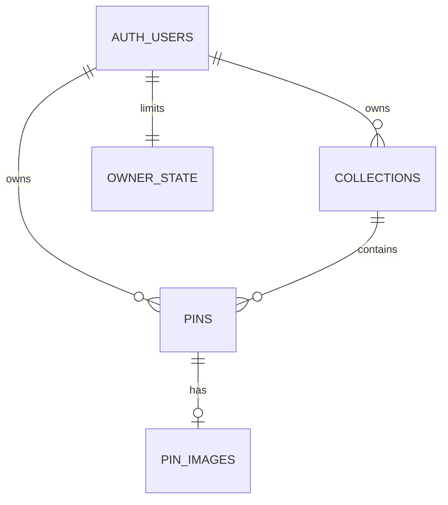

# Backend integration plan

## Current delivery: frontend first

The Expo frontend is usable through **Try the demo** with no credentials or services. A fresh repository in memory supplies sample pins on each visit. Edits and chosen photos reset when leaving/reloading; they are not uploaded. Account forms are present, but live access is disabled unless `EXPO_PUBLIC_ENABLE_BACKEND=true` and valid public configuration are supplied.

Backend source was drafted before the frontend-first decision. It is retained for the next phase, not deployed or accepted for production. The Supabase tables and relations still need to be installed; the R2 bucket and media function still need configuration.

## Data model

| Table | Fields and relationship | Access |
| --- | --- | --- |
| `auth.users` | Supabase-managed identity | Auth service |
| `public.collections` | UUID id, owner_id, name, description, created_at | Only owner reads/creates/edits |
| `public.pins` | UUID id, owner_id, collection_id, title, notes, timestamps | Only owner reads/creates/edits |
| `public.pin_images` | One image per pin, owner_id, R2 full/thumb keys, bytes, created_at | Owner reads; media server writes |
| `private.owner_state` | Owner counter/lock row, deletion state | Server/triggers only |
| `private.media_inventory` | Durable reservations and deletion tombstones for image objects | Server/cleanup operator only |

Composite foreign keys pair the parent ID with `owner_id`, so a pin cannot refer to another user's collection and an image cannot refer to another user's pin. Row level security and restricted column grants protect ownership independently of the app. Server operations coordinate deletions with image storage. Indexes cover owner/collection and newest-first pagination.

Named collections serve as the first category system. Future collection types (pins, coins, cards) can add a type field without embedding pin-specific concepts in storage ownership. Public profiles/sharing require a separate visibility model and authorization review; the initial tables stay private.

## Next phase, in order

1. **Resolve the media retry race before deployment.** Current draft retries use deterministic object keys. A timed-out upload could complete late and overwrite a later successful retry. Use inventoried keys per upload attempt, commit only the winning attempt, and clean up abandoned attempts. Add a test where the first PUT completes after the retry commits. Existing cleanup tests do not cover this active-image case.
2. Review the migration against the chosen project's existing schema, then apply it without resetting other data. Generate client database types from the resulting schema.
3. Configure email confirmation, the recovery-code email template, redirect URLs, SMTP, and invite-only signup settings for the first testers.
4. Create the private R2 bucket and a bucket-scoped object read/write token. Configure server secrets, browser CORS and the media function. Schedule the cleanup script.
5. Fill client-safe URL/key placeholders, then explicitly enable the backend. Replace the demo session with real Auth through the already-separated repository interface.
6. Test with two real accounts: collection and photo isolation, forged parent IDs, expired/revoked sessions, photo upload/read/expiry, failed-upload retries, deletion, account deletion and cleanup. Use a real multi-connection PostgreSQL runtime to check concurrency.
7. Test camera/library permissions, background/foreground sessions, keyboard/modal layouts and photo memory on Android and iOS devices. Produce development builds before store builds.

## Configuration to supply later

| Location | Values |
| --- | --- |
| Ignored `.env.local` | `EXPO_PUBLIC_ENABLE_BACKEND`, Supabase URL and publishable/anon key |
| Ignored `supabase/.env.local` / hosted secrets | R2 account ID, bucket name, access key ID, secret access key, allowed web origins; server-only database pooler URL if needed |
| Supabase tooling | Local CLI login or dashboard access to apply migrations and deploy; never paste tokens into chat |
| Expo/store tooling | Expo project, unique Android/iOS app IDs, developer accounts and signing credentials |

The publishable key is designed for clients. Service-role keys, database credentials, R2 keys and deployment tokens must never be in `EXPO_PUBLIC_*` or Git. Templates contain placeholders; existing ignored local values are preserved.

See [backend reference](BACKEND.md) for the drafted API/deployment details. Service integration, native release testing and store publication are intentionally pending.
